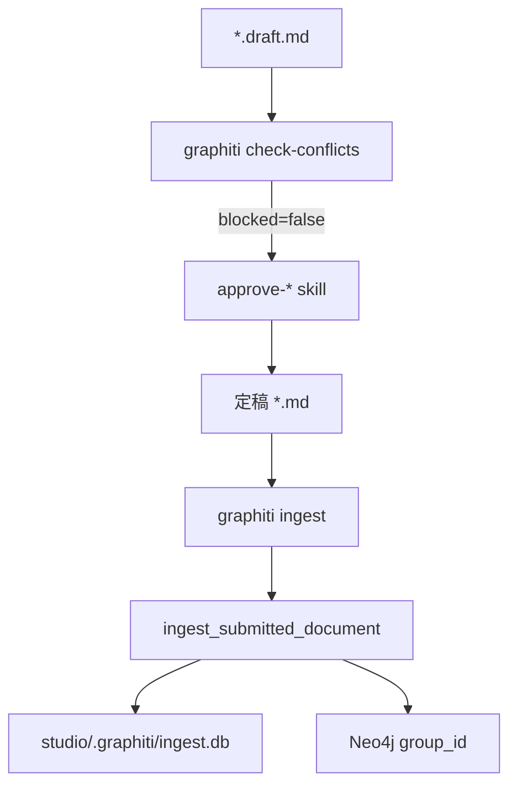

# Graphiti Novel Studio — 开发交接文档

> 生成日期：2026-05-21  
> 仓库：`OpenHarness` + 小说项目 `my-novel/`  
> 用途：换编辑器后继续开发时阅读本文 + 计划文件。

---

## 1. 项目目标

为 **novel-studio** 工作流接入 **Graphiti + Neo4j** 作为动态设定记忆层：

- **Markdown**（`studio/**/*.md`）= 人类可读完整文稿（git）
- **SQLite**（`studio/.graphiti/ingest.db`）= 段落 uid、hash、episode 映射、submit 审计
- **Neo4j / Graphiti** = 可查询的结构化 canon（实体、关系、段 episode）

**原则：** 仅 **approve 定稿后** ingest；草稿 `*.draft.md` 不写图。

---

## 2. 当前状态一览

| 模块 | 状态 | 测试 |
|------|------|------|
| 段落拆分 / reconcile / supersede | ✅ | TC-SS-01/02/05/06 |
| `inject_paragraph_uids` 回写 Markdown | ✅ | TC-SS-07 |
| Prescribed ontology + 中文 summary | ✅ | test_ontology |
| `NarrativeElement` 统一标签 + 排除裸 `Entity` | ✅ | 实机 integration-test |
| 实体生命周期提升 | ✅ | test_entity_promotion |
| Agent 工具 + OpenHarness 注册 | ✅ | — |
| CLI `graphiti ingest` / `check-conflicts` | ✅ | — |
| 冲突门禁（approve 前） | ✅ | TC-SS-04 + Neo4j 实机 + 新规则单元测试 |
| approve 技能接线 | ✅ | — |
| `openai_summarizer` | ✅ | 已实现 OpenAI summarizer，支持中/英双语，且通过 mock 进行单元测试。 |
| MCP `search_facts` / `remove_episode` 工具 | ⏳ 未做 | — |
| `@pytest.mark.integration` CI | ⏳ 未做 | — |

**测试：** `uv run pytest tests/test_graphiti -q` → **36 passed**

---

## 3. 架构（三层存储）

```text
Authoring          Local index              Graph (Neo4j)
─────────          ───────────              ─────────────
*.draft.md         (不 ingest)
*.md 定稿    →     ingest.db (SQLite)  →   Graphiti episodes
                   paragraph_uid            Entity + RELATES_TO
                   submit_runs
```



---

## 4. 代码地图（`src/openharness/graphiti/`）

| 文件 | 职责 |
|------|------|
| [`paragraphs.py`](../src/openharness/graphiti/paragraphs.py) | 自然段拆分、`paragraph_uid`、`inject_paragraph_uids` |
| [`reconcile.py`](../src/openharness/graphiti/reconcile.py) | 按 uid 增删改 reconcile |
| [`ingest_store.py`](../src/openharness/graphiti/ingest_store.py) | SQLite schema + `IngestStateStore` |
| [`ingest.py`](../src/openharness/graphiti/ingest.py) | submit 管道；ingest 后自动 `run_entity_promotions` |
| [`client.py`](../src/openharness/graphiti/client.py) | Graphiti SDK；默认 ontology；`excluded_entity_types=['Entity']` |
| [`ontology.py`](../src/openharness/graphiti/ontology.py) | Major/Minor/Related/NarrativeElement + 抽取说明 |
| [`entity_promotion.py`](../src/openharness/graphiti/entity_promotion.py) | NarrativeElement → Minor → Major 规则 |
| [`promotion_runner.py`](../src/openharness/graphiti/promotion_runner.py) | Neo4j 改 label |
| [`canon_classify.py`](../src/openharness/graphiti/canon_classify.py) | 背景 vs 实体 vs NarrativeElement 规则分类 |
| [`conflicts.py`](../src/openharness/graphiti/conflicts.py) | 冲突检测 + `ConflictReport.blocked` |
| [`summarize.py`](../src/openharness/graphiti/summarize.py) | `passthrough_summarizer` + `openai_summarizer` |
| [`prompts_patch.py`](../src/openharness/graphiti/prompts_patch.py) | Graphiti summary 与原文同语言（中文） |
| [`tools.py`](../src/openharness/graphiti/tools.py) | Agent 工具 |
| [`cli.py`](../src/openharness/graphiti/cli.py) | Typer 子命令 |

**注册：** [`src/openharness/tools/__init__.py`](../src/openharness/tools/__init__.py) 中 `graphiti_tools()`  
**CLI 挂载：** [`src/openharness/cli.py`](../src/openharness/cli.py) `app.add_typer(graphiti_app)`

---

## 5. 本体设计（方案 C，用户已定）

### 人物

| 类型 | 何时用 | 字段 |
|------|--------|------|
| `MajorCharacter` | 段落主体（李默） | `personality`, `background`（身世一段）, `appearance`, `current_status` |
| `MinorCharacter` | 老者、路人 | 仅 `scene_note` |
| `RelatedPerson` | 李默的母亲 | `anchor_name`, `relationship`, `role_note` |
| `NarrativeElement` | 外门弟子、基础剑法 | `element_kind`, `element_note` |

### 规则（重要）

- **丧父、性格、抚养** → 写入 `MajorCharacter.background`，**不建节点**
- **禁止裸 `Entity` 标签**（`client` 默认 `excluded_entity_types=['Entity']`）
- **summary / fact / 属性** 与原文同语言（中文稿 → 全中文）

### 生命周期

```text
NarrativeElement  →(多段出现/戏份增加)→  MinorCharacter  →(背景综述)→  MajorCharacter
```

ingest 结束自动跑 [`run_entity_promotions`](../src/openharness/graphiti/promotion_runner.py)。

---

## 6. 环境与命令

### 依赖

```bash
cd /Users/jzj/ai_writing/OpenHarness
uv sync --extra dev --extra graphiti
```

### Neo4j（小说项目）

```bash
cd my-novel
cp .env.example .env   # 填 NEO4J_PASSWORD、OPENAI_API_KEY
docker compose up -d
```

Browser: http://localhost:7474 ，查询务必带 `group_id`：

```cypher
MATCH (n) WHERE n.group_id = 'integration-test' RETURN n
```

### 环境变量（`my-novel/.env`）

```bash
NEO4J_URI=bolt://localhost:7687
NEO4J_USER=neo4j
NEO4J_PASSWORD=novel-graphiti-dev
GRAPHITI_GROUP_ID=my-novel   # 或 integration-test
OPENAI_API_KEY=...
```

### CLI

```bash
set -a && source my-novel/.env && set +a

# approve 前 — 冲突门禁（exit 1 = 阻断）
uv run openharness graphiti check-conflicts \
  --source my-novel/studio/chapters/story.v1.md \
  --focus 李默 \
  --group-id integration-test

# approve 后 — ingest
uv run openharness graphiti ingest \
  --studio-root my-novel/studio \
  --source my-novel/studio/chapters/story.v1.md \
  --gate approve-chapter \
  --kind chapter \
  --scope chapter_all \
  --group-id integration-test
```

### 测试

```bash
uv run pytest tests/test_graphiti -q
```

---

## 7. Agent 工具列表

| 工具名 | 用途 |
|--------|------|
| `get_status` | Neo4j 连通性 |
| `add_episode` | 原始 Graphiti 加 episode |
| `classify_canon_snippet` | 判断背景 / NarrativeElement / 实体 |
| `add_canon_episode` | 带 ontology 的 ingest 单段 |
| `promote_canon_entities` | 手动重跑 label 提升 |
| `check_canon_conflicts` | 冲突门禁 |

---

## 8. approve 技能流程（已更新）

[`examples/novel-studio/commands/approve-chapter/SKILL.md`](../examples/novel-studio/commands/approve-chapter/SKILL.md)：

1. REJECT / REVISE 检查  
2. **`graphiti check-conflicts`（复制前）**  
3. Copy draft → final  
4. **`graphiti ingest`**  
5. 写 approval marker  

白皮书：[`approve-whitepaper/SKILL.md`](../examples/novel-studio/commands/approve-whitepaper/SKILL.md) 同理。

---

## 9. 测试夹具（short_story）

| 文件 | 场景 | 测试 |
|------|------|------|
| `tests/fixtures/short_story/story.v1.md` | 基线 3 段 | TC-SS-01/02 |
| `story.v2-add.md` | 增段 | TC-SS-03 |
| `story.v3-delete.md` | 删段 | TC-SS-05 |
| `story.v4-edit.md` | 改出生地（江城→邺城） | TC-SS-06 + 冲突门禁实机 |

---

## 10. 已验证的实机结论（Neo4j）

1. **ingest `story.v1`**：`integration-test` 分组 → 李默 1 个节点，`background` 含丧父/性格；`NarrativeElement` 有外门弟子、基础剑法；无裸 Entity。  
2. **冲突门禁**：先 ingest v1 再 ingest v4-edit 后，`check-conflicts --focus 李默` → `blocked: true`，消息含「江城 / 江北邺城」。  
3. **重复李默节点**：Browser 未滤 `group_id` 时会看到 `ontology-v1-test` + `integration-test` 两套数据；查询时务必加 `WHERE n.group_id = '...'`。

---

## 11. 计划文件（给其他 LLM 请用仓库内导出）

| 文件 | 说明 |
|------|------|
| **[`docs/graphiti-plans-export.md`](graphiti-plans-export.md)** | **Part A 总计划 + Part B 细项状态 + Part C YAML TODO（推荐）** |
| [`docs/graphiti-novel-handoff.md`](graphiti-novel-handoff.md) | 交接上下文（本文档） |

Cursor 原始路径（仅本机）：  
`~/.cursor/plans/graphiti_novel_todo_5077ebaf.plan.md`  
`~/.cursor/plans/graphiti_remaining_work_9249c0bd.plan.md`

小说 schema：[`my-novel/docs/graphiti-schema-v1.md`](../my-novel/docs/graphiti-schema-v1.md)

---

## 12. 待办（建议下一编辑器优先）

1. **MCP 工具** — `search_facts`、`remove_episode`、`delete_entity_edge` 包装进 [`tools.py`](../src/openharness/graphiti/tools.py)  
2. **`@pytest.mark.integration`** — 可选 Neo4j CI，无 `NEO4J_URI` 时 skip  
3. **`inject_paragraph_uids` 在 approve 默认开启** — CLI 已 `--write-uids` 默认 true  

---

## 13. 对话中的关键决策（避免重做）

| 话题 | 决策 |
|------|------|
| Graphiti 接入方式 | Python SDK，非 MCP 做主路径 |
| 索引库 | SQLite `ingest.db`，非 JSON |
| 删改段 | hard delete `remove_episode` + edge delete |
| 段落身份 | `paragraph_uid` UUID，approve 时写入 md |
| 性格/丧父 | `background` 字段，非独立节点 |
| 外门弟子/剑法 | `NarrativeElement` 标签 |
| summary 语言 | 与原文一致（`prompts_patch`） |
| 实体提升 | ingest 后自动 + `promote_canon_entities` 工具 |

---

## 14. 已知问题 / 噪音

- Graphiti 建索引时 Neo4j 日志大量 `EquivalentSchemaRuleAlreadyExists` — 可忽略。  
- Graphiti 偶发把「长老」抽成 `NarrativeElement`；多段后可提升为 `MinorCharacter`。  
- `conflicts.py` 已经支持 **出生地** (identity)、**亲属与师徒** (relationship) 以及 **生死/时间线** (timeline) 的矛盾规则与门禁检测。  
- [`ingest.py`](../src/openharness/graphiti/ingest.py) 在 `write_uids_to_markdown=True` 时已可调用 `inject_paragraph_uids`（已实现）。

---

## 15. 快速恢复开发

```bash
cd /Users/jzj/ai_writing/OpenHarness
git status   # 大量 graphiti 相关改动在 working tree
uv sync --extra dev --extra graphiti
uv run pytest tests/test_graphiti -q
cd my-novel && docker compose up -d
```

换编辑器后：先读本文 + `graphiti_remaining_work` 计划 → 从 **§12 待办** 选一项开工即可。
